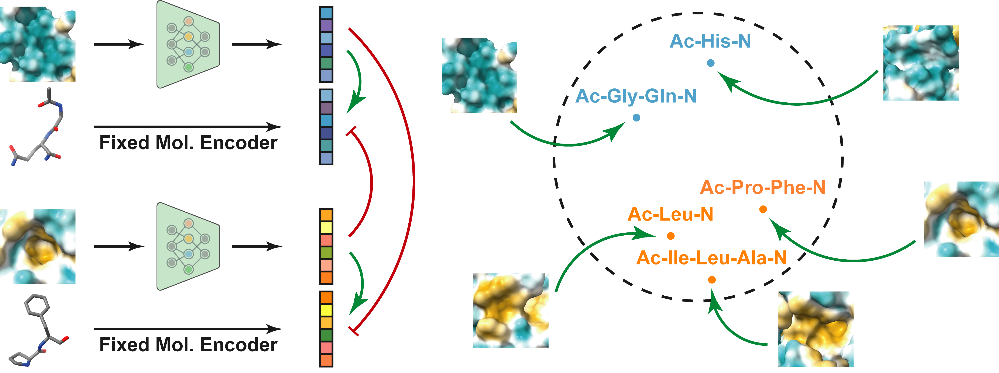

# ProFSA - Self-supervised Pocket Pretraining via Protein Fragment-Surroundings Alignment

<br>

Official repository for ["Self-supervised Pocket Pretraining via Protein Fragment-Surroundings Alignment"](https://github.com/hughplay/TVR).

<!--  -->


**Figure:** *An illustration of protein fragment-surroundings alignment framework.*

> **Self-supervised Pocket Pretraining via Protein Fragment-Surroundings Alignment** <br>
> Bowen Gao, Yinjun Jia, Yuanle Mo, Yuyan Ni, Wei-Ying Ma, Zhi-Ming Ma, Yanyan Lan <br>
> *Published on The Twelfth International Conference on Learning Representations (ICLR 2024)*

[](https://hongxin2019.github.io/TVR/)
[](https://github.com/hughplay/TVR)
[](https://hongxin2019.github.io/TVR/dataset)
[](https://hongxin2019.github.io/TVR/explore)
[](https://arxiv.org/pdf/2011.13160.pdf)
[](https://pytorch.org/get-started/locally/)
[](https://github.com/hughplay/DeepCodebase)


<br>

## Description

Pocket representations play a vital role in various biomedical applications, such as druggability estimation, ligand affinity prediction, and de novo drug design. While existing geometric features and pretrained representations have demonstrated promising results, they usually treat pockets independent of ligands, neglecting the fundamental interactions between them. However, the limited pocket-ligand complex structures available in the PDB database (less than 100 thousand non-redundant pairs) hampers large-scale pretraining endeavors for interaction modeling. To address this constraint, we propose a novel pocket pretraining approach that leverages knowledge from high-resolution atomic protein structures, assisted by highly effective pretrained small molecule representations. By segmenting protein structures into drug-like fragments and their corresponding pockets, we obtain a reasonable simulation of ligand-receptor interactions, resulting in the generation of over 5 million complexes. Subsequently, the pocket encoder is trained in a contrastive manner to align with the representation of pseudo-ligand furnished by some pretrained small molecule encoders. Our method, named ProFSA, achieves state-of-the-art performance across various tasks, including pocket druggability prediction, pocket matching, and ligand binding affinity prediction. Notably, ProFSA surpasses other pretraining methods by a substantial margin. Moreover, our work opens up a new avenue for mitigating the scarcity of protein-ligand complex data through the utilization of high-quality and diverse protein structure databases.

If you find this code useful, please consider to star this repo and cite us:

```
@inproceedings{gao2023self,
  title={Self-supervised Pocket Pretraining via Protein Fragment-Surroundings Alignment},
  author={Gao, Bowen and Jia, Yinjun and Mo, YuanLe and Ni, Yuyan and Ma, Wei-Ying and Ma, Zhi-Ming and Lan, Yanyan},
  booktitle={The Twelfth International Conference on Learning Representations},
  year={2023}
}
```


<br>

## Pre-requirements

- [Docker](https://docs.docker.com/engine/install)
- [Nvidia-Docker](https://docs.nvidia.com/datacenter/cloud-native/container-toolkit/install-guide.html#docker)
- [docker-compose](https://docs.docker.com/compose/install/)

<!-- <br> -->


## Quick Start


TLDR; We have prepare the commands in the `Makefile` for you:

```bash
make init                           # run in host, build a docker image for api server and launch the container
make in                             # run in host, ctrl + d to exit the container

# experiment
make wandb_login                    # run in container, login to wandb
make train                          # run in container, train the model
make table                          # run in container, generate the latex table

# commit
make copy_git                       # run in host, copy git config to the container home
make precommit_install              # run in container, prepare pre-commit for tidy code
git add . && git commit -m "xxx"    # run in container, commit code, it will run pre-commit check

# profiling
python train.py experiment=mnist_lenet debug=profiler  # run in container, using pytorch profiler to profile the code
make nsightrun cmd="python train.py experiment=mnist_lenet debug=nsight"  # run in container, launch a nsight system profiler
```

Below is the detailed instructions.

**1. Create new project from template**

Click [[Use this template]](https://github.com/hughplay/DeepCodebase/generate) to create a new project from this template.

**2. Clone the new project to local**

You can find the repository url in the new project page.

```bash
git clone <repo url>
```

**3. Prepare docker environment**


Build the docker image and launch the container with:

```bash
python docker.py startd --build
```

**4. Enter the docker container**

Enter the container with:

```bash
python docker.py
```

The docker container is our development environment.

**5. Train a model**

Launch training with:

```bash
python train.py experiment=mnist_lenet
```

or launch multiple training at once:

```bash
python batchrun.py scripts/train/train_baselines.sh --quotas 1
```

**6. View results on wandb**

The training results will be automatically uploaded to wandb. You can view the results on [wandb.ai](https://wandb.ai).

**7. Generate Latex table**

After training multiple models, you can generate a latex table with:

```bash
python scripts/gen_latex_table.py --table baseline
```

This will generate a table like this:

```latex
\usepackage{booktabs}

\begin{table}[t]
\centering
\small
\caption{Performance on the MNIST dataset. }
\label{tab:baseline}
\begin{tabular}{lr}
\toprule
Model & Accuracy \\
\midrule
DNN & 0.974566 \\
LeNet & \textbf{0.983000} \\
\bottomrule
\end{tabular}
\end{table}
```

**8. Custom your own project**

Modify the code to fit your own deep learning project. Check our [document](https://hongxin19.github.io/deepcodebase/) for more details.


**9. Commit you modifications**

We strongly recommend you to use [pre-commit](https://pre-commit.com/) to check your code before commiting. Before you first commit, you need to install the pre-commit hook with:

```bash
pre-commit install
```

Then, you can commit your modifications with normal git commands.

```bash
git add .
git commit -m "commit message"
```

It will show you the errors if your code does not pass the pre-commit checks. After you fix the errors, you need to git add the modified files and commit again.


## Cite us

Give a star and cite us if you find this project useful.

[](https://github.com/hughplay/DeepCodebase)

```md
[](https://github.com/hughplay/DeepCodebase)
```

*This is a project based on [DeepCodebase](https://github.com/hughplay/DeepCodebase) template.*

``` md
*This is a project based on [DeepCodebase](https://github.com/hughplay/DeepCodebase) template.*
```

## Projects based on DeepCodebase

- [TVR](https://github.com/hughplay/TVR)

## License

DeepCodebase is released under the [MIT license](LICENSE).
